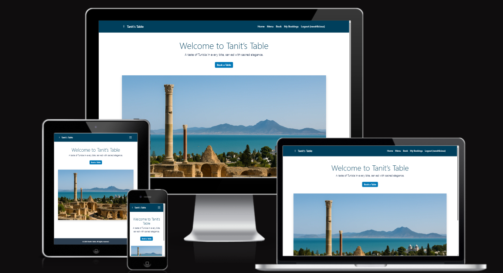
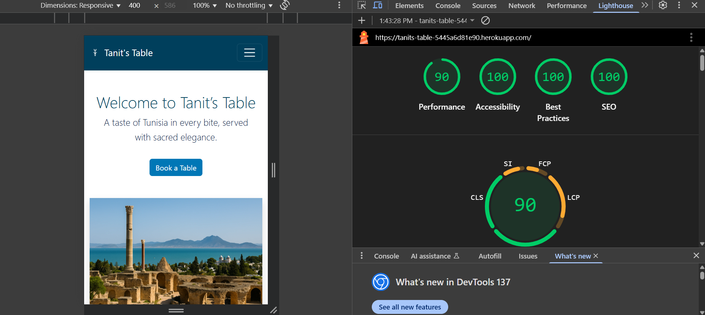
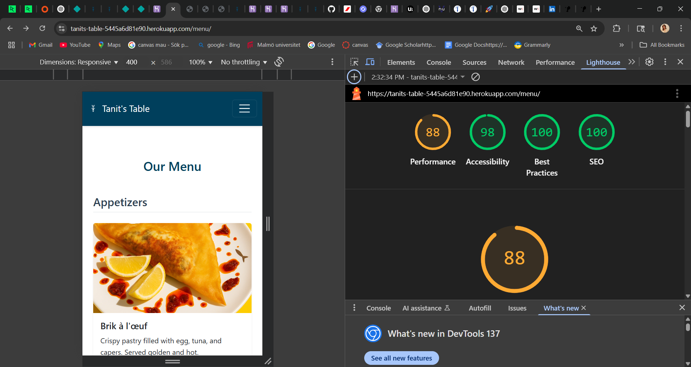
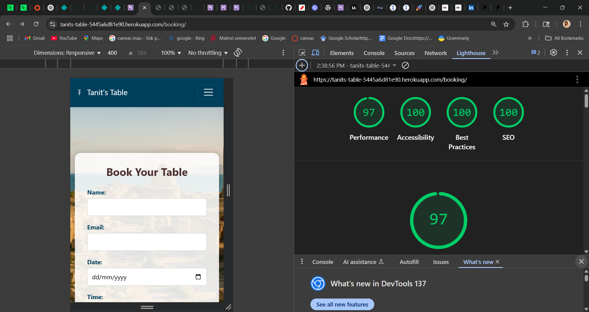
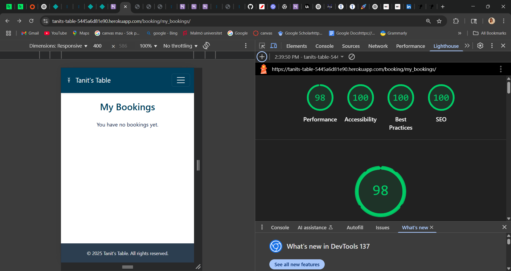

# Tanit's Table

**Live Site:** [View the live project here](https://tanits-table-5445a6d81e90.herokuapp.com)

Tanit’s Table is a fictional Tunisian restaurant website built with Django. The site allows users to view the menu, learn about the restaurant, and make a table reservation. It is designed to showcase clean design, responsive layout, and CRUD functionality for bookings. This project is part of the Full Stack Development course at Code Institute.

---

## Table of Contents

- [User Experience (UX)](#user-experience-ux)
  - [User Stories](#user-stories)
  - [Design](#design)
- [Features](#features)
- [Technologies Used](#technologies-used)
- [Testing](#testing)
- [Deployment](#deployment)
- [Credits](#credits)
- [Acknowledgements](#acknowledgements)

---

## User Experience (UX)

### User Stories

#### First Time Visitors
- I want to understand what kind of food the restaurant serves.
- I want to see the restaurant’s contact information and location.
- I want to browse the menu and make a booking.

#### Returning Visitors
- I want to check if my previous booking still exists.
- I want to cancel or modify my reservation.

#### Site Owner
- I want to display the restaurant’s menu in an elegant way.
- I want users to be able to make, edit, and delete bookings.

### Design

- The site uses a warm, earthy color palette inspired by Tunisian culture.
- It includes a clear navigation bar, footer with contact/social links, and a hero banner.
- Pages are responsive on mobile, tablet, and desktop.

---

## Features

### Implemented Features

| Feature           | Description                                                                  |
|------------------|------------------------------------------------------------------------------|
| Homepage          | Welcome section with restaurant intro, image banner, and map.               |
| Navigation Bar    | Fixed nav with links to Home, Menu, Book a Table, and Login/Register.       |
| Menu Page         | Bootstrap cards displaying sample Tunisian dishes.                          |
| Booking System    | Users can create a booking with name, date, time, and number of guests.     |
| User Auth         | Users can log in, view their bookings, edit, or cancel them.                |
| CRUD              | Bookings support full CRUD (Create, Read, Update, Delete) functionality.    |
| Footer            | Contact info, address, and placeholder social links.                        |
| Responsive Design | Tested and responsive across multiple devices and screen sizes.             |

---

## Technologies Used

- **Languages:** HTML5, CSS3, Python
- **Frameworks:** Django, Bootstrap 5
- **Libraries:** Crispy Forms, gunicorn
- **Database:** SQLite (development), Postgres via Heroku (deployment)
- **Hosting:** Heroku
- **Version Control:** Git, GitHub
- **Others:** Django Allauth (user accounts)

---

## 🧪 Testing

### ✅ Functional Testing

| **Feature**         | **Test Performed**                                                                 | **Result**              |
|---------------------|-------------------------------------------------------------------------------------|-------------------------|
| Booking Creation    | User can submit the table reservation form and see a confirmation message          | Working as expected ✅   |
| Edit Booking        | Logged-in user can access the edit form, change details, and submit successfully    | Working as expected ✅   |
| Cancel Booking      | User can cancel a booking, which is removed from their "My Bookings" list           | Working as expected ✅   |
| User Auth Flow      | Registration, login, logout, and access control work without issues                 | Working as expected ✅   |
| Navigation Links    | Navbar links redirect to the correct pages for all screen sizes                     | Working as expected ✅   |
| Static Files        | CSS loads properly; favicon, background images, and style assets display correctly  | Working as expected ✅   |

### 📱 Responsive Testing

| Device              | Browser        | Notes     |
|---------------------|----------------|-----------|
| iPhone 12           | Safari/Chrome  | ✅         |
| Samsung Galaxy S20  | Chrome         | ✅         |
| iPad                | Safari         | ✅         |
| Desktop (1920px)    | Chrome/Firefox | ✅         |
| Samsung Zflip 6     | EDGE           | ✅         |

---
### 🔎 Validators

- **HTML:** Validated using [W3C Validator](https://validator.w3.org/)
  
    
  

- **CSS:** Checked with [W3C CSS Validator](https://jigsaw.w3.org/css-validator/)
  
  

- **Python:** Validated with `flake8`
  
  

---

### 📊 Lighthouse Testing

| Page           | Performance | Accessibility | Best Practices | SEO  | Screenshot |
|----------------|-------------|----------------|----------------|------|------------|
| Home           | 90          | 100            | 100            | 100  |  |
| Menu           | 88          | 98             | 100            | 100  |  |
| Book a Table   | 97          | 100            | 100            | 100  |  |
| My Bookings    | 98          | 100            | 100            | 100  |  |

All pages passed Lighthouse audits with high scores.

---

## Deployment

### Steps:

1. GitHub repo created and code pushed.
2. Heroku app set up with Postgres, gunicorn, and required environment variables.
3. Static files handled using WhiteNoise.
4. Cloudinary used for media file storage.
5. App deployed live at: [https://tanits-table-5445a6d81e90.herokuapp.com](https://tanits-table-5445a6d81e90.herokuapp.com)

---

## Credits

- **Developed by:** Navah Eierdal  
- **Inspiration:** Code Institute Django walkthroughs, Tunisian cuisine & culture  
- **Images:** DALLE  

---

## Acknowledgements

- Thanks to the Code Institute Slack community for support.  
- Special thanks to reviewers and peers who gave feedback during development.
